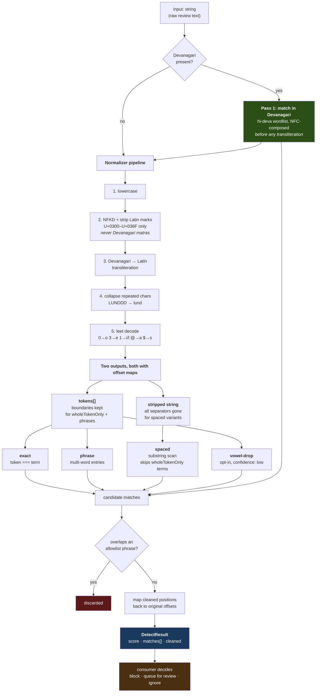
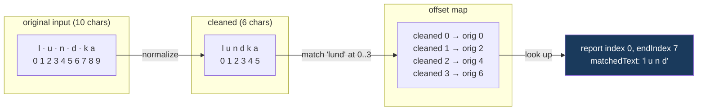

# How detection works

`detect(input, options)` never guesses and never decides. It cleans the input,
looks the cleaned text up in three wordlists, and reports what it found along
with where it found it.

## The whole flow

## Why the offset map exists

The matcher searches the *cleaned* text, but every reported `index` must point
into the *original* text. They are different strings of different lengths.

Without the map, `lund` found at cleaned `0..3` would be reported as original
`0..3`, and the consumer slicing the original gets `"l u "`.

This matters because the transformations are not only deletions:

| transformation | example | length change |
| --- | --- | --- |
| strip separators | `l u n d` → `lund` | 7 → 4 |
| collapse repeats | `LUNDDD` → `lund` | 6 → 4 |
| leet decode | `ch00tiya` → `chootiya` | same, different chars |
| transliterate | `चूतिया` → `chutiya` | 6 → 7 (grows) |

Only plain unobfuscated text has `cleaned.length === input.length` — and that is
the only case where you did not need a profanity filter.

## Why Devanagari is matched first

Transliteration is lossy in a way that breaks both directions:

- `लंड` (slur) transliterates to `land` — which is an ordinary English word, and
  is **not** `lund`, so matching after transliteration both misses the slur and
  invites a false positive.
- `लैंड` (the English word "land" written in Devanagari) is a different string
  from `लंड`, so matching *before* transliteration separates them cleanly.

So hi-deva terms are matched against the raw Devanagari, NFC-composed. Only then
does the text get transliterated for the benefit of the Latin wordlists.
